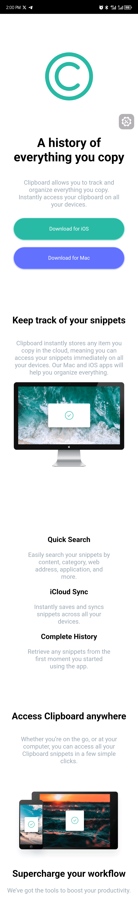
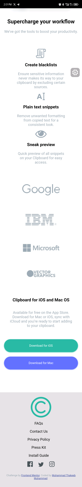

# Frontend Mentor - Clipboard landing page solution

This is a solution to the [Clipboard landing page challenge on Frontend Mentor](https://www.frontendmentor.io/challenges/clipboard-landing-page-5cc9bccd6c4c91111378ecb9). Frontend Mentor challenges help you improve your coding skills by building realistic projects. 

## Table of contents

- [Overview](#overview)
  - [The challenge](#the-challenge)
  - [Screenshot](#screenshot)
  - [Links](#links)
- [My process](#my-process)
  - [Built with](#built-with)
  - [What I learned](#what-i-learned)
  - [Continued development](#continued-development)
- [Author](#author)
- [Acknowledgments](#acknowledgments)

## Overview

### The challenge

Users should be able to:

- View the optimal layout for the site depending on their device's screen size
- See hover states for all interactive elements on the page

### Screenshot

## Desktop View

## Mobile View

### Links

- Solution URL: [Solution URL](https://www.frontendmentor.io/solutions/responsive-clipboard-landing-page-f-88wFOHBp)
- Live Site URL: [Add live site URL here](https://thakeeb22.github.io/Clipboard-landing-page/)

## My process

### Built with

- Semantic HTML5 markup
- CSS custom properties
- Flexbox
- CSS Grid

### What I learned

I learnt more of how to use CSS GRID and FLEXBOX to create a very responsive web layout

### Continued development
I wish to continue exploring the 2 powerful tools for web layout and later try boostrap

## Author

- Website - [Muhammad Thakeeb Muhammad](https://thakeeb22.github.io/Clipboard-landing-page/)
- Frontend Mentor - [@Thakeeb22](https://www.frontendmentor.io/profile/Thakeeb22)
- Twitter - [@MuhammadThakeeb](https://x.com/MuhammadThakeeb?s=09)

## Acknowledgments

I acknowledge my progress in learning frontend development. I Pray to achieve more
